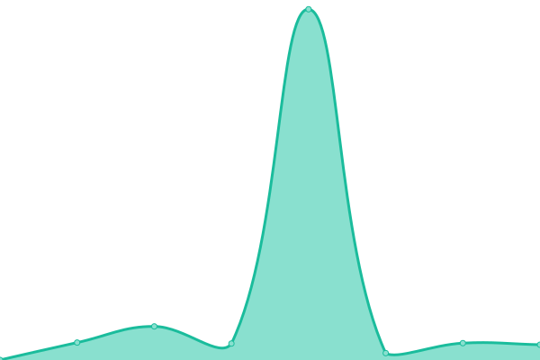
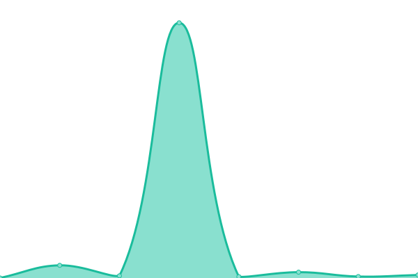
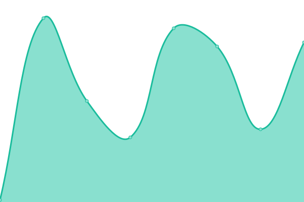
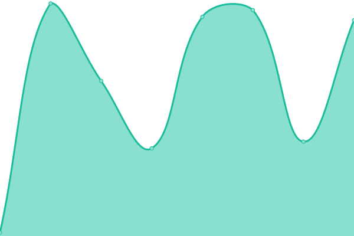

# [📈 Live Status](https://reduct-inc.github.io/reduct-status): <!--live status--> **🟩 All systems operational**

This repository contains the open-source uptime monitor and status page for [Reduct, Inc](https://reduct-inc.github.io/reduct-status), powered by [Upptime](https://github.com/upptime/upptime).

With [Upptime](https://upptime.js.org), you can get your own unlimited and free uptime monitor and status page, powered entirely by a GitHub repository. We use [Issues](https://github.com/reduct-inc/reduct-status/issues) as incident reports, [Actions](https://github.com/reduct-inc/reduct-status/actions) as uptime monitors, and [Pages](https://reduct-inc.github.io/reduct-status) for the status page.

<!--start: status pages-->
<!-- This summary is generated by Upptime (https://github.com/upptime/upptime) -->
<!-- Do not edit this manually, your changes will be overwritten -->
<!-- prettier-ignore -->
| URL | Status | History | Response Time | Uptime |
| --- | ------ | ------- | ------------- | ------ |
|  [Reduct Video Status](https://app.reduct.video) | 🟩 Up | [reduct-video-status.yml](https://github.com/reduct-inc/reduct-status/commits/HEAD/history/reduct-video-status.yml) | 

 268ms
     
 | 

<a href="https://status.reduct.video/history/reduct-video-status">100.00%</a>
    

|  [Main Servers Status](https://app.reduct.video/x/status) | 🟩 Up | [main-servers-status.yml](https://github.com/reduct-inc/reduct-status/commits/HEAD/history/main-servers-status.yml) | 

 50ms
     
 | 

<a href="https://status.reduct.video/history/main-servers-status">100.00%</a>
    

|  [Transcripts Status](https://app.reduct.video/x/tsss/status) | 🟩 Up | [transcripts-status.yml](https://github.com/reduct-inc/reduct-status/commits/HEAD/history/transcripts-status.yml) | 

 46ms
     
 | 

<a href="https://status.reduct.video/history/transcripts-status">100.00%</a>
    

|  [Rendering Status](https://app.reduct.video/x/render/status) | 🟩 Up | [rendering-status.yml](https://github.com/reduct-inc/reduct-status/commits/HEAD/history/rendering-status.yml) | 

 60ms
     
 | 

<a href="https://status.reduct.video/history/rendering-status">100.00%</a>
    

|  [Live Transcripts Status](https://app.reduct.video/x/live-transcription/status) | 🟩 Up | [live-transcripts-status.yml](https://github.com/reduct-inc/reduct-status/commits/HEAD/history/live-transcripts-status.yml) | 

 72ms
     
 | 

<a href="https://status.reduct.video/history/live-transcripts-status">100.00%</a>
    

|  [Transcript Processing Status](https://app.reduct.video/x/whisper/status) | 🟩 Up | [transcript-processing-status.yml](https://github.com/reduct-inc/reduct-status/commits/HEAD/history/transcript-processing-status.yml) | 

 66ms
     
 | 

<a href="https://status.reduct.video/history/transcript-processing-status">100.00%</a>
    

<!--end: status pages-->

[**Visit our status website →**](https://reduct-inc.github.io/reduct-status)

## 📄 License

- Powered by: [Upptime](https://github.com/upptime/upptime)
- Code: [MIT](./LICENSE) © [Anand Chowdhary](https://anandchowdhary.com), supported by [Pabio](https://pabio.com)
- Data in the `./history` directory: [Open Database License](https://opendatacommons.org/licenses/odbl/1-0/)
